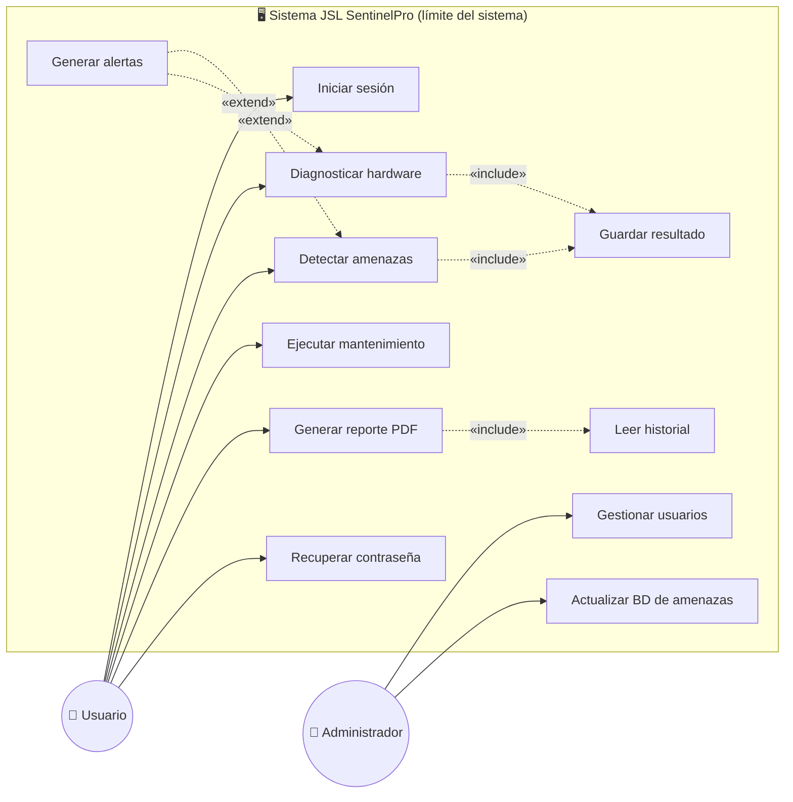

# Diagrama de Casos de Uso — JSL SentinelPro (corregido)

> Corrige la **Figura 20** del documento: `<<include>>` y `<<extend>>` bien dirigidos,
> sin casos de uso duplicados, con el actor **Administrador** reflejado y el límite del
> sistema explícito. Mermaid no tiene notación UML de casos de uso nativa, así que se
> representa con un grafo + convenciones marcadas.

## Correcciones respecto a la Figura 20 original

| Error original | Corrección aquí |
|---|---|
| `<<extend>>` mal dirigido | La flecha `«extend»` va **desde la extensión hacia el caso base**: `Generar alertas «extend» Detectar amenazas / Diagnosticar hardware`. |
| `Generar alertas «extend» Configurar sistema` (sin sentido) | Las alertas se disparan desde **detección/diagnóstico**, no desde configuración. |
| `Configurar sistema` duplicado | Cada caso de uso aparece **una sola vez**. |
| Faltaban `<<include>>` obvios | `Generar reporte «include» Leer historial`; `Detectar amenazas` y `Diagnosticar hardware` **«include» Guardar resultado**. |
| Actor **Administrador** no reflejado | Incluido con `Gestionar usuarios` y `Actualizar BD de amenazas`. |
| Límite del sistema difuso | Un solo rectángulo (`subgraph SYS`) contiene los casos de uso; los actores quedan **fuera**. |

> **Convención:** línea punteada `«include»` = el caso base siempre ejecuta el incluido;
> `«extend»` = comportamiento opcional que extiende al base (dirección extensión → base).