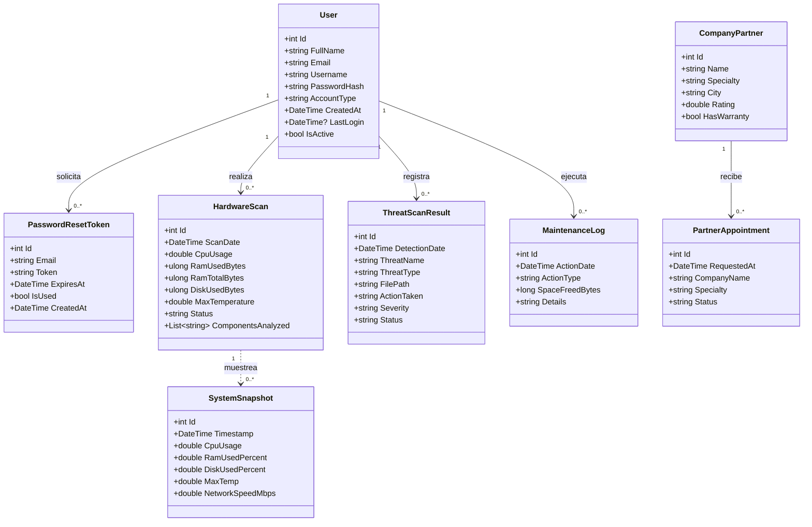
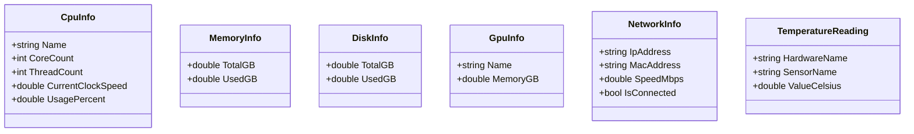
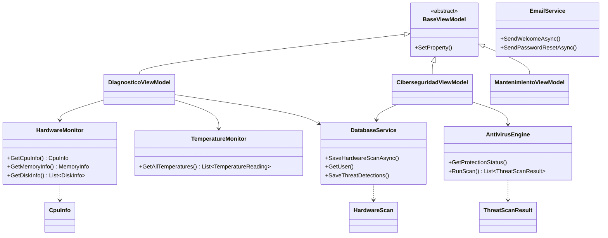

# Diagrama de Clases — JSL SentinelPro

> Modelo de dominio y capa de servicios **reales** del código (C#/.NET, MVVM).
> Atributos tomados de `src/Models/` y servicios de `src/Core/`.

## 1. Modelo de dominio (entidades que persisten en SQLite)

## 2. Objetos de lectura de hardware (no persisten; se muestran en pantalla)

## 3. Capa de servicios (MVVM)

> **Nota (corrige el documento):** no hay clases de "backend" separado ni ORM web.
> La persistencia es **SQLite local** vía `DatabaseService`; los servicios Core son
> clases C# en el mismo proceso de la aplicación de escritorio.