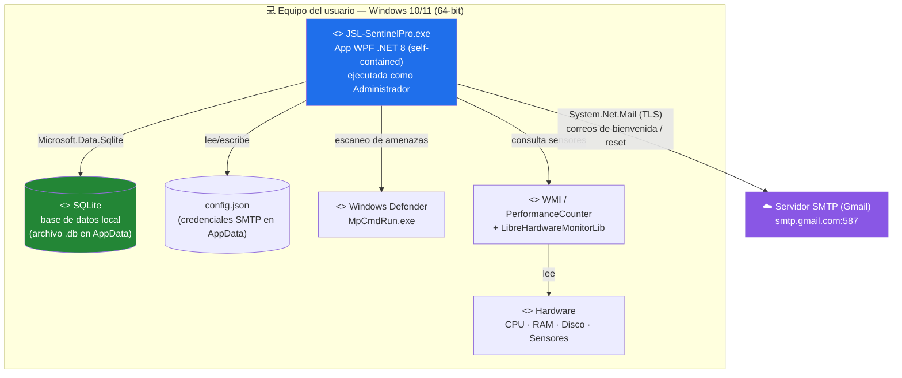

# Diagrama de Despliegue — JSL SentinelPro

> Es el diagrama que **resuelve la confusión "web vs escritorio"** del documento.
> Todo corre en **la máquina Windows del usuario**. No hay Vercel, ni Railway, ni
> servidor remoto. La única salida a red es el envío de correos por SMTP.

## Nodos

| Nodo | Qué es | Dónde vive |
|---|---|---|
| **JSL-SentinelPro.exe** | La aplicación WPF completa (UI + servicios) | Equipo del usuario |
| **SQLite (.db)** | Persistencia local (usuarios, escaneos, amenazas, logs) | Equipo del usuario (AppData) |
| **config.json** | Credenciales SMTP (no hardcodeadas) | Equipo del usuario (AppData) |
| **Windows Defender** | Motor antivirus real invocado por la app | Sistema operativo |
| **WMI + LibreHardwareMonitor** | Fuente de datos de hardware/sensores | Sistema operativo |
| **Servidor SMTP (Gmail)** | Único componente externo; solo para correos | Nube (Google) |

> **Requisito clave:** la app necesita **permisos de Administrador** (UAC) para
> leer sensores y ejecutar Windows Defender — por eso se distribuye con `app.manifest`
> que solicita elevación. Esto confirma que es **escritorio**, no web.