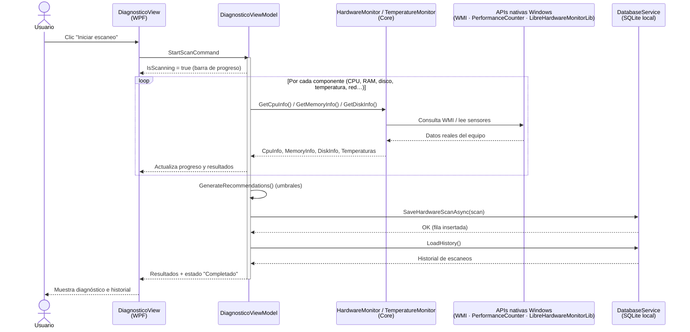
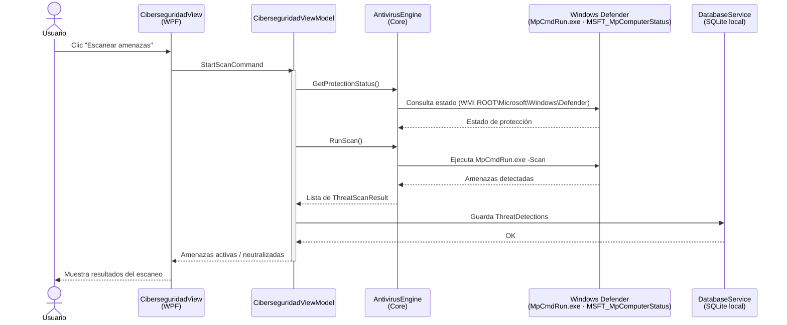
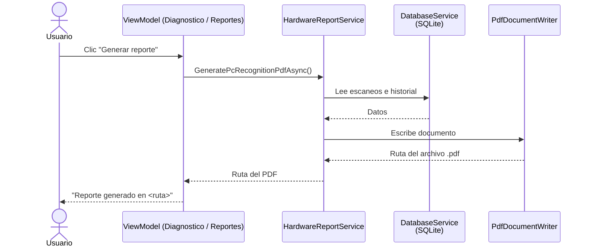

# Diagrama de Secuencia — JSL SentinelPro (corregido)

> Reemplaza la **Figura 21** del documento. Refleja la arquitectura **real**:
> aplicación de **escritorio C#/.NET WPF** con patrón **MVVM**, servicios en proceso,
> APIs nativas de Windows y base de datos **SQLite local**.
> **No hay** navegador, **no hay** backend Python/Node, **no hay** servidor remoto.

---

## 1. Flujo principal — Diagnóstico de hardware

---

## 2. Flujo — Detección de amenazas (antivirus)

---

## 3. Flujo — Generar reporte PDF

---

## 4. Qué se corrigió respecto a la Figura 21 original

| Error en la Figura 21 | Corrección aquí |
|---|---|
| Rótulo **"Backend (Python)"** | No existe backend Python. Los servicios (`HardwareMonitor`, `AntivirusEngine`, `DatabaseService`) son clases **C#/.NET en proceso**. |
| Flujo web **navegador → backend** | Es **escritorio WPF**: `View → ViewModel → Servicio Core → API nativa/SQLite`. |
| **"Enviar amenazas detectadas"** salía de la **Base de Datos** | Las amenazas las detecta el **AntivirusEngine (Windows Defender)**, no la BD. La BD solo **persiste** el resultado. |
| Servidor/BD remotos (MySQL/Railway) | **SQLite local**, sin servidor. |
| Lectura de hardware desde el navegador | El navegador no puede leer CPU/RAM/temperatura; aquí se lee con **WMI + LibreHardwareMonitorLib** directamente en el equipo. |
| "Tiempo real" prometido | La barra de progreso es **retroalimentación de UI**; el diagnóstico es una operación puntual bajo demanda (no streaming continuo). |

> **Nombres de participantes** = clases reales del código (`DiagnosticoViewModel`,
> `HardwareMonitor`, `AntivirusEngine`, `DatabaseService`, `PdfDocumentWriter`),
> para que el diagrama sea trazable al software entregado.
