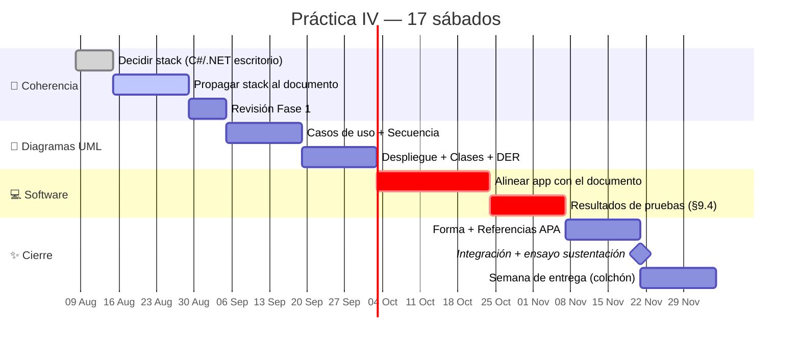

# 🗺️ Roadmap — Práctica IV (Ago → Nov 2026)

**Equipo:** 🟦 **S** Saray · 🟩 **D** David · 🟨 **J** Juan David · 🟧 **A** Alejandro
**Entrega final:** última semana de noviembre — documento + software + sustentación.

---

## Línea de tiempo

---

## Fases de un vistazo

| Fase | Cuándo | Foco | Líder |
|:--:|---|---|:--:|
| 1 | **Agosto** | Cerrar la incoherencia del stack y bajar alcance (Ada Test, malware) | 🟩 D |
| 2 | **Septiembre** | Diagramas UML: casos de uso, secuencia, despliegue, clases, DER | 🟩 D |
| 3 | **Octubre** 🔴 | Software funcional alineado al documento — **ruta crítica** | 🟨 J |
| 4 | **Noviembre** | Pulido, APA, ensayo de sustentación (2 sábados de colchón) | 🟦 S / 🟧 A |

> 🔴 **Octubre es el punto crítico:** sin app funcional no hay sustentación.
> Los 2 últimos sábados son colchón intencional para imprevistos y ensayo.

---

## Roles

| | Integrante | Responsabilidad |
|:--:|---|---|
| 🟦 **S** | Saray | Frontend/UX · redacción y forma del documento |
| 🟩 **D** | David | Arquitectura y diagramas UML (líder técnico del documento) |
| 🟨 **J** | Juan David | Backend/lógica · agente de diagnóstico y detección |
| 🟧 **A** | Alejandro | Frontend/UX · mockups y referencias (APA) |
